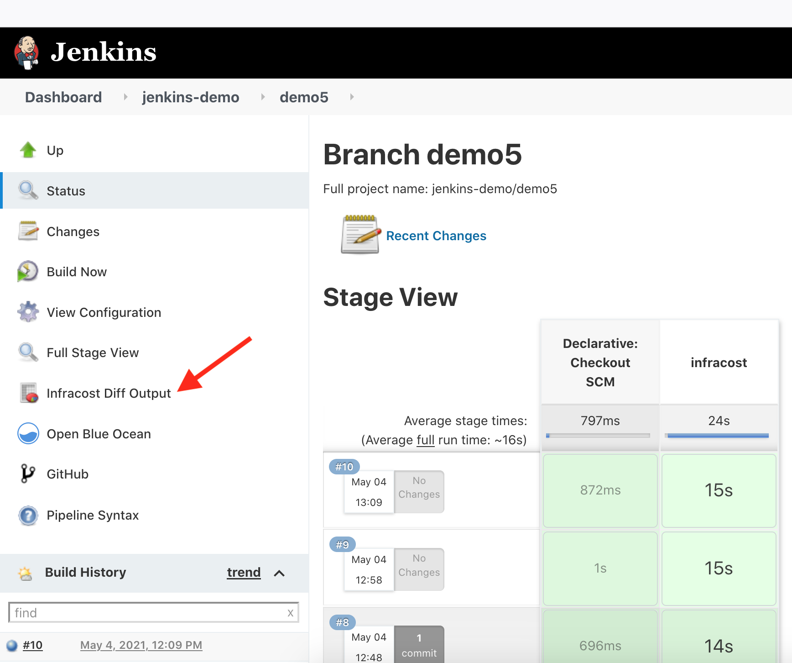
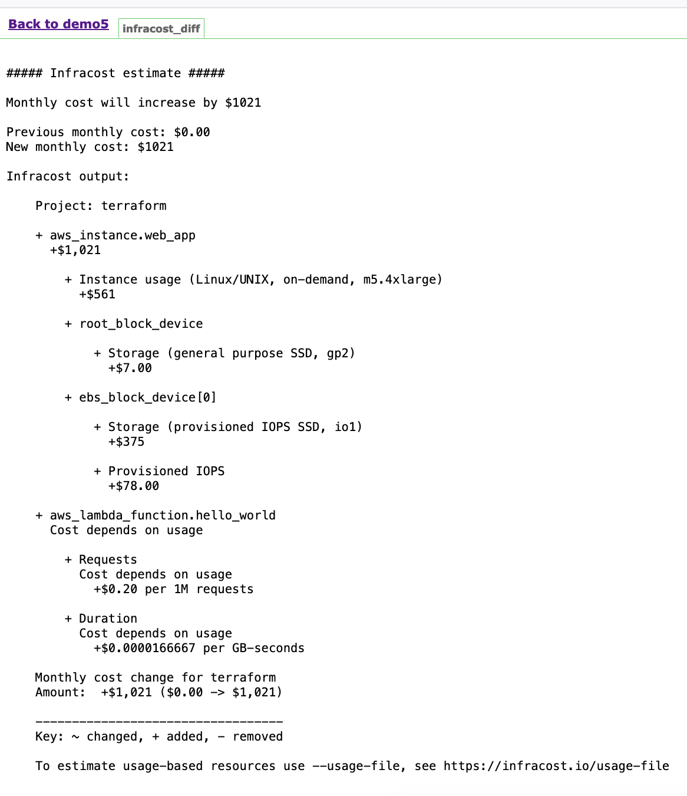

# Infracost Jenkins Demo

See [this pull request](https://github.com/infracost/jenkins-demo/pull/2) and the following screenshots for the demo.

The [Infracost Jenkins](https://github.com/infracost/infracost-jenkins/) integration runs [Infracost](https://infracost.io) against a Terraform project and generates an HTML page for each run, to show the Infracost diff output.

See the [Infracost integrations](https://www.infracost.io/docs/integrations/cicd) page for other integrations.

<kbd></kbd>

<kbd></kbd>
